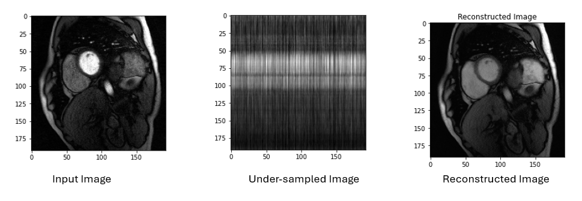

# MRI Image Reconstruction using Autoencoders

## Introduction
This project aims to reconstruct undersampled MRI images, significantly reducing acquisition time to one-fourth of the conventional duration. By leveraging deep learning techniques, particularly autoencoders, we aim to enhance the quality of MRI images while minimizing the amount of data collected during the imaging process.

## Theory
Magnetic Resonance Imaging (MRI) is a powerful imaging modality used in medical diagnostics. However, traditional MRI techniques often require long acquisition times, leading to discomfort for patients and increased operational costs. Undersampling is a technique where fewer data points are collected than traditionally required, but this can result in image artifacts and loss of detail.

Autoencoders, a class of neural networks, can learn efficient representations of data. In this project, we use a deep autoencoder to reconstruct undersampled MRI images. The autoencoder consists of two parts: the encoder compresses the input image into a lower-dimensional representation, while the decoder reconstructs the image from this representation.

## Objectives
- Reduce MRI acquisition time by employing undersampling techniques.
- Develop a robust autoencoder model capable of accurately reconstructing undersampled images.
- Evaluate the model's performance using metrics such as Mean Squared Error (MSE) and visual inspection of the reconstructed images.
- Provide a comprehensive pipeline to automate the data preprocessing, model training, and evaluation processes.

## Model Design
The autoencoder model consists of:
- **Encoder**: A sequence of Dense layers that compresses the input image into a latent representation.
- **Decoder**: A series of Dense layers that reconstructs the image from the latent space back to the original dimensions.
- **Loss Function**: Binary cross-entropy is used to measure the reconstruction error.
- **Optimizer**: Stochastic Gradient Descent (SGD) is employed to update the model weights during training.

## Scripts Overview
### `dataset.py`
This script handles the loading of training and testing datasets from the specified directory. It reads the MRI images and prepares them for further processing.

### `preprocess.py`
This script performs preprocessing tasks on the MRI images, including resizing and normalizing the data. It also generates training labels based on random binary arrays to simulate undersampling.

### `model.py`
This script defines and compiles the autoencoder model, setting up the architecture and training parameters necessary for the reconstruction task.

### `train.py`
This script handles the training of the autoencoder model. It visualizes the training loss and metrics, providing insight into the model's performance during training.

### `test.py`
This script evaluates the trained model on the test dataset. It reconstructs the undersampled images and visualizes the results to compare them against the original images.

### `pipeline.py`
This script orchestrates the entire end-to-end process, from data loading and preprocessing to model training and evaluation. It integrates all the other scripts, providing a streamlined workflow for the project.

### `main.py`
This is the entry point of the project. It allows users to run the entire pipeline by providing the dataset path as a command-line argument.

## Results

## Conclusion
This project demonstrates the potential of deep learning techniques, particularly autoencoders, in reconstructing undersampled MRI images. By reducing acquisition times, we can enhance patient comfort and improve the efficiency of MRI procedures in clinical settings.
